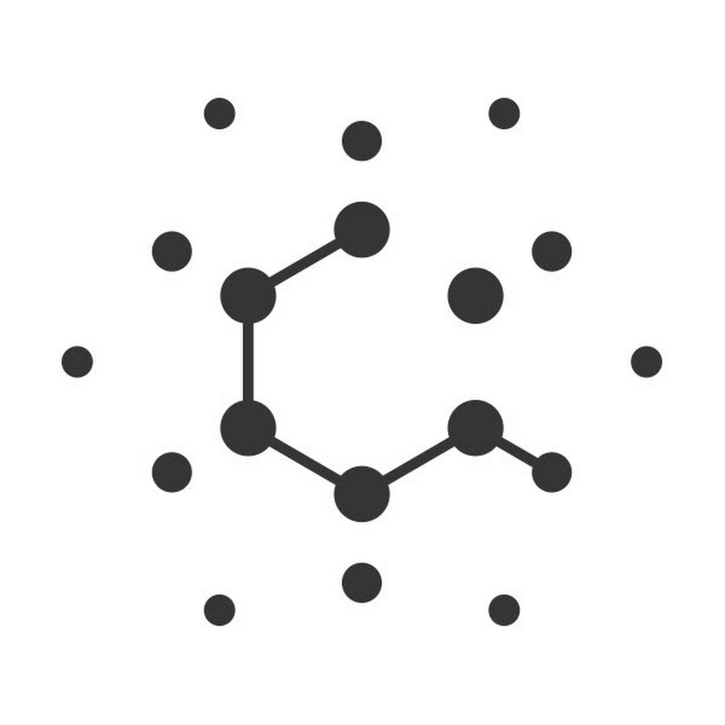

<h1 align=center>

<code>( /\ /? /\ \/ [- |_ /\</code>

</h1>

Logo is quanta Magazine but I like the vibe, is here for inspo.

# Description
Caravela uses a relative position system. It measures your position to 16 marks and encodes each vector as a sequence of nearest neighbors (ABCD). This provides
1. Speed: New queries only have to check their distance to 16 marks.
2. Memory Reduction: Each point is encoded into the vector of neighbours which is `64` bits.
3. Accuracy: 16 points partition a space into over 20 Trillion(!) regions.

# Index Creation
Index creation has to be done in a carefull way as to assure that the 20Trl regions in fact exist. The region boundaries are the bisectors of every pairwise set of marks. To ensure that all possible permutation exist then we must create a polygon with the points that ensure that there is intersection between any two of these bisectors. MOreover we must ensure that it contains the data.

For now my soultion has been to use a 16-simplex centered on the mean of the data. This assures not only the intersection of all bisectors but allso that such intersection occurs smack down in the middle of the data.
It is easy to see that an n-simplex will contain all possible permutations since a simplex is given by:

$$ \Delta = \left( \theta_1u_1 + \theta_2u_2 + \theta_3u_3 + \dots + \theta_nu_n \middle| \sum_i \theta_i =1\right)$$

It seems to me that as long as we make sure that the data is contained in the simplex then all regions should be accessible. As in, a point `x` will be in region $ABCD$ if $\theta_A > \theta_B > \theta_C > \theta_D$. But i might be wrong, altough early tests point otherwise.

Currently each vertex of the simplex is positioned along the first 16 direction of the PCA, centerd in the mean of the data at the distance of the amplitude of the data. This might change altough it doesnt seem to affect much the results.

# Indexing
Use PCA to get 16 principal components and place simplex at center of data (mean).
For each point:
1. Calculate distance to simplexes
2. Calculate binary representation of permutation
3. While binary is not 00000..00:
    - Check if it exists in the data.
    - if yes -> add just the point id
    - if no ->
    - Iterate through every point and check if they are a transposition
    - if yes -> add itself as a neighbour
    - keep track of neighbours
    - Add point to hash with list of found transpositions.

# Query

1. Measure distance of point to simplexes.
2. Calculate vector of weights wij = |d1 - d2| (inverse)
3. Calculate binary vector

**Positioning**
1. While binary is not 00000..00:
2. Check if binary exists in graph:
3. If not remove last 1.

**Search**
1. For point in neighbour, if not in evaluated, add to BinaryHeap.
{important question, is it better to evaluate again or query the BinaryHeap? (fundamental and requires testing)}
2. For point in
2. If current node is better than all BinaryHeaps
    - Add current node to "accepted"
    - Add current node to visisted
    - Move to minimum of BinaryHeap

# Stats
Assume `n` points in a `d` dimensional vector space with `k=16` marks. 
1. **Speed**:
    - Index Creation -> PCA + distance to n points should be something like `O(n logn + d )`
    - Query -> Distance to `k=16` points + tree transversal that's `O(k)`
2. **Memory**:
    - Permutations can be encoded into `O(k logk) = 64` bits (half the size of a pointer) which is great if we manage to add no memory overhead. Means we can't use pointers in query.
    - Realistically I think we will be looking at `128` bits per sample which is a shame but query speed is more important. Besides still beats the `256`bits of `faiss` and `scann`.
3. **Accuracy**:
    - Not expecting anything less than 100% recall rate untill 20_000_000_000_000 (20 trillion) samples. Probably won't be true but there's no reason why we shouldn't be aiming towards that ballpark.
    - The more accurate the algorithm is the faster it is since the main bottleneck is tree search.

# Todo
    - [ ] Find more about hyperplane arranjements and simplexes.
    - [ ] Find data structure. Compressed prefix tree seems apropriate but maybe there's better.
    - [ ] Figure out query algorithm. Prefix tree search could work on O(k) -> O(1) but memory overhead seems inapropriate. There has to be a smarter way.
    - [ ] Need a good PCA. Not problematic since its at index creation.
    - [ ] Test something other than the mean for simplex center.   
    - [ ] Test limit of 16 point partition in n-dimensional space
    - [ ] Test simplex structure. Compare with:
        - [x] Random arranjement
        - [x] K-Means
        - [ ] Unaligned Simplex (no PCA)
        - [ ] PCA with eight vectors
        - [ ] Others
    - [ ] Figure out arranjement for dimensions less than 15. Maybe revisit PCA with 2 points per pc (original idea)
    - [ ] Test effect of amplitude and component weights (even though equidistance seems a must).

# Routines
    - [x] Permutations to binary.
    - [x] Identity Hash
    - [x] is_transposition
    - [ ] Weighted hamming
    - [ ] 

